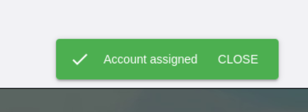

# **How to assign roles**

---
This tutorial is intended for users with an Administrator role (aka `admin`).
We are going to explain how can you assign a specific role to a user.

Keep in mind that the following roles exist:

* Administrator
* Investor
* Developer
* Fund
* Issuer
* Regional Center

**Note:** If this is your first time you log in, we recommend reading the tutorial: [How to log in the Proxy website](../Tutorials/telos_account.md).

**Note2:** If you don't assign a role to a new user, they won't be able to see any project or perform actions within the website. 

1. First, we need to access the official PROXY [site](https://prxfi.com/). You should see something like this:

 

 

2. Click on the  `LOGIN WITH PROXY FINANCIAL`

 

 

3. Log in with`Anchor Wallet` and sign the transaction:

 

 

4. Once you've logged in, you should see a window like this:

- All available projects will be displayed here.

 

 

5.  If we click on the three lines (it's in the top left corner), a new menu will be displayed.

Here we have two options: 

- `Register Project:` Used to register a new project.
- `Add role to account:` Used to assign a role to a new user.

 

 

6. By this time, we're going to focus on how to assign a role to a new user. Please click on `Add role to account` button.

 

 

7. Next a new window will appear.

 

 

8. Here we can see a new section `Assign Role to Account`. There's two available fields:

- `Write the account name`: Here you need to type the account name of the user that you want to register on the Proxy website.

    **Remember:** Telos accounts are always lower-case, don't worry if you capitalize the first letter, our amazing team will automatically fix it for you.
    
    
- `Choose the role to assign`: Choose one of the displayed roles.

 

9. First type the new account name:

 

 

10. Then choose one of the displayed roles.

 

 

11. For this example, we'll select `Investor` role. Click on the `Investor role`.

 

 

12. The click on the `ASSIGN ROLE` button. 

 

 

13. `Anchor wallet` will pop-up, so you should see something like this.

 

 

There are a couple of considerations to keep in mind, let's analyze this `Anchor Wallet` window:

* You only have 0:30 seconds to complete the transaction. 

 

 

* If you don't complete the transaction within the time, you should see this advice:

 

 

* Here we can see the Transaction information we're sending:
    | Field | Value | Description |
    | -- | -- | -- |
    | account | proxyinvestor12 | New account we want to register |
    | actor | proxyadmin11 | Administrator who perfom the transaction | 
    | role | investor | Role we assigned to the new user |
    | username |  proxyinvestor12 | Arbitrary name to identify the user inside Proxy database |

 

 

* It also displays the `SIGNATURES REQUIRED` to perform this transaction, in this case: `proxyadmin11@active`.

14. Next step if to sign the transaction, click on the green button.

 

 

15. Congratulations! You've registered a new user! You should a confirmation message like this:

 

 

### **We are done with this tutorial.**
