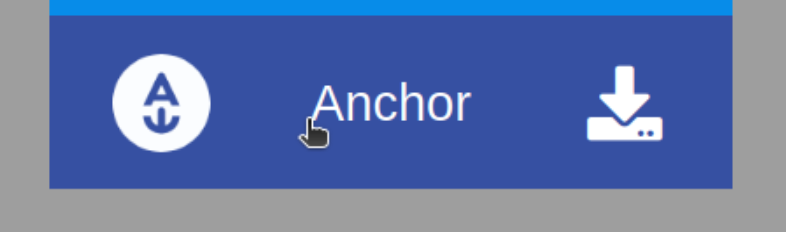

# **How to create a Telos account**

In this tutorial we're going to explore how to create a Telos account to begin our journey!
Throughout the next tutorials, you will see some words [highlighted in blue](#reference4). If you click on them, they will take you to an external page if that is the case, or they will redirect you to some section of this document.

To begin, you need to have installed one of the follow browsers:
- Firefox -> Download [here](https://www.mozilla.org/en-US/firefox/new/).
- Google chrome -> Download [here](https://www.google.com/chrome/).

**Note:** This tutorial is intended for Windows, macOS & Linux users.

**Note2:** If you aren't familiar with any of the concepts, we suggest reading the [last section](#reference3) first.

---

## **Create Telos account**
First we need to access the official Telos [site](https://www.telos.net/signup) to get this view:

 

 

1. Select an account name:
- The account name must contain 12 lowercase characters only and number from 1 to 5.
- If you see a message like: `The account "usertest1212" already exists`, please change the name of the account.

2. Copy and save **both** keys (public & private): For example in a blocnotes file.

- These keys ensure that only you can access and perform actions with your account. Your public key is visible by everyone using the network. The private key, however, will never be shown. You must store your private key in a safe location as it should not be shared with anyone.

- **IMPORTANT:**  Save your keys somewhere safe. They will not be stored for you. Once you exit this window, you'll **NEVER** be able to recover these keys. 
-  Keep in mind that if you lose your keys, you lose your account. *Make as many backup copies as you think necessary*.

 

**Note:** See this [tutorial](#reference3) for more information related to backups. 

3. Check the box: `I have copied my keys somewhere safe`.

 

 

4. Check the next box: `I'm not a robot`.

 

 

5. Remember to copy both keys to a safe place before continuing.
Click on `Continue`.

 

 

6. Congratulations, your account has been created!

 

 

7. Next step is to login with your new account. Before doing so, please refer to the following [tutorial](#reference1): `"How to install Anchor"`. You can close the current tab, we won't modify any aspect of our account. 

 

---

# **How to install Anchor**

---

We need a `Wallet` with the intention of saving our keys and being able to sign and perform transactions. We recommend `Anchor Wallet`.

    "Anchor is a security and privacy focused open-source digital wallet for all EOSIO-based networks."

**Note:** Due to different versions and updates of `Anchor Wallet`, the interface you see may vary slightly.

 

1. First, we need to download Anchor fromAnchor its Official site, [here](https://greymass.com/en/anchor/download). You'll see the next window: 
Anchor

 

**Note:** You can manage your wallet from your personal computer or with your smartphone.

Anchor is available for the follow Operating Systems:
- macOS
- Windows
- Linux

2. Click on `Download for Windows` if you're using a computer with Windows, if not, click on the icons below to select your operating system:

Once the download is complete, click on the executable and follow the provided steps.

 

4. Select the destination folder, then click on `install`.

 

5. Wait for the installation, then click on `Next`.

 

 

6. Check the box `Run Anchor Wallet`.

 

7. You should see a similar window like this:

 

 

8. Click on `Setup an Account`.

 

 

9. Then you'll see the next window. Here you need to define a password for your wallet. **Save it!** As the warning says, if you forget or lose your wallet's password, you won't be able to recover your wallet in the future. *Make as many backup copies as you think necessary.*

 

**Note:** See this [tutorial](#reference3) for more information related to backups. 

 

 

10. Once you have saved your password in a safe place. Click on `Set password`.

 

 

11. Next you should see something like this: Select `Telos` chain.

 

 

12. Next step if to import your previous `Telos account` to your `Anchor Wallet`. After select the `Telos chain`, you'll see the next, click on `Import an existing Account`. 

 

 

13. Then click on `Import Private Key`.

 

 

14. Now we need to copy/paste our previous `private key`. Make sure to paste the `private key`, if you try to paste the `public key`, Anchor won't be able to find your account. 

 

 

15. `Anchor` may take a while to find your account, be patient. After a while, you'll see a new section called `Accounts found to match key` and below the public key associated to your `private key`. Select both accounts:
 - `youraccountname@active` 
 - `youraccountname@owner`

 

 

16. Then click on `Import Account(s)`

 

 

17. `Anchor` will pop-up a new window `Authorization Required`, type your Wallet's password and then click on `Authorize`.

 

 

18. Next you should see something like this:

 

 

19. **Congratulations!**, now you have Anchor installed, and a `Anchor Wallet` with the `public & private keys` associated to your account.

20. Finally we need to login on Proxy [site](). Follow the next [tutorial](#reference2): `"How to login in Proxy website"`.

 

--- 

# How to login in Proxy website

--- 

1. First, we need to access the official PROXY [site](https://prxfi.com/). You should see something like this:

 

 

2. Click on the  `LOGIN WITH PROXY FINANCIAL`

 

 

3. The next window will pop-up. 

 

 

4. Click on the `Anchor`button.

 

 

5. Next you should see this window:
- **Remember:** You could login from your personal computer or using an smartphone. 

 

 

6. Click on `Launch Anchor` button.

 

 

7. `Anchor Wallet` will pop-up a window like this:

 

 

8. Select your `active/hot` account. 

**Note:** There's a slightly difference between `active` & `owner` accounts, we don't need to know that for now. 

9. Then click on the green button to sign the transaction.

 

 

**Note:** If you see the nex view, it means you doesn't have unlocked your wallet, don't worry. You just need an extra step:

 

 

Click on the `lock` button.

 

 

11. Ok, we can continue. After click the green or blue button, `Anchor Wallet` will require your password. **Remember:** It's your Wallet's password.

 

 

12. Then next section should appear: `Authorize Wallet Action`.

 

 

13. In this case just enter the wallet password to continue. 

 

 

14. Then click on the `Authorize` button. 

 

 

15. **Congratulations!** Now you've been login in Proxy website. 

- Note: You should see something like next if this is your first time and you don't have any project assigned to you. Talk with an `Admin` to solve this. 

 

 

16. For example, if I'm a builder with a project, I should see this view:

 

 

--- 

# **How to Safely Store Your Wallet**

--- 
In the next tutorial, we're going to talk about some concepts related to wallets & keys so you can be familiar with these concepts.

- ### **About Keys**

You will be given two kinds of keys: a public key, which functions similar to an email address (you may safely share it with others, enabling you to send and receive payments), and a private key, which is often a string of letters and numbers (and which is not to be shared with anyone). 

- ### **What is a private key?**

A `private key` is a secret string of letters and numbers that allows you to access and manage your cryptocurrency funds. It is like a password that proves your ownership of your cryptocurrency.

-  ### **About Wallets**

Just like your bank PIN, it’s important to keep your private keys safe! Store them offline somewhere safe. Some investors choose to keep their private keys on a computer that isn’t connected to the internet, written on pieces of paper, or even just memorized.

A common misconception in cryptocurrency regarding wallets is that they store tokens. However, in reality, a wallet is used to store private keys in an encrypted file to sign transactions. Wallets do not serve as a storage medium for tokens.

A user builds a transaction object, usually through an interface (`Proxy website`), sends that object to the wallet to be signed (`Anchor Wallet`), the wallet then returns that transaction object with a signature which is then broadcast to the network. When/if the network confirms that the transaction is valid, it is included into a block on the blockchain.

- ### **Where To Store Private Keys?**

1. **Hardware Wallets:**  Use hardware wallets to keep your private keys safe. A hardware wallet is a flash drive-like device, designed specifically for storing your private keys.

2. **Online? AT YOUR OWN RISK!:** Is not recommended keep private keys online, in the mail, or in the cloud because they are most susceptible to getting hacked there. A lot of users take screenshots of the private keys, and their photo album is usually synced online. This creates a security risk and is something you should at your own risk.

3. **Offline Flash drive:** If you don’t have a hardware wallet, you can temporarily keep your private keys or seed in an offline flash drive or HDD. But these options are only safe as long as they aren’t in the hands of an attacker. 

4. **Paper wallet:** A paper wallet is free and is just a piece of paper that prints the pair of private and public keys on it. 

5. **Memorize it:** It is pretty much hard to memorize your private key. 

Having said that, we hope these insights will help you in making the best decision for yourself and also help you secure your private keys. 

