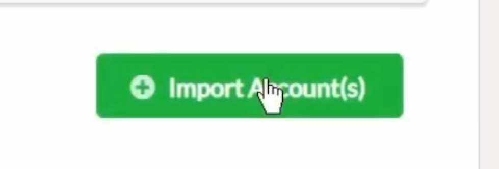

# **How to create a Telos account**

In this tutorial we're going to explore how to create a Telos account to begin our journey!

You need to have installed one of the follow browsers:
- Firefox -> Download [here](https://www.mozilla.org/en-US/firefox/new/).
- Google chrome -> Download [here](https://www.google.com/chrome/).

**Note:** This tutorial is intended for Windows, macOS & Linux users.

---

## **Create Telos account**
First we need to access the official Telos [site](https://www.telos.net/signup) to get this view:

 

 

1. Select an account name:
- The account name must contain 12 lowercase characters only and number from 1 to 5.
- If you see a message like: `The account "usertest1212" already exists`, please change the name of the account.

2. Copy and save **both** keys (public & private): For example in a blocnotes file.

- These keys ensure that only you can access and perform actions with your account. Your public key is visible by everyone using the network. The private key, however, will never be shown. You must store your private key in a safe location as it should not be shared with anyone.

- **IMPORTANT:**  Save your keys somewhere safe. They will not be stored for you. Once you exit this window, you'll **NEVER** be able to recover these keys. 
-  Keep in mind that if you lose your keys, you lose your account. *Make as many backup copies as you think necessary*.

3. Check the box: `I have copied my keys somewhere safe`.

 

 

4. Check the next box: `I'm not a robot`.

 

 

5. Remember to copy both keys to a safe place before continuing.
Click on `Continue`.

 

 

6. Congratulations, your account has been created!

 

 

7. Next step is to sign in with your new account. Before doing so, please refer to the following [tutorial](#reference1): `"How to install Anchor"`. You can close the current tab, we won't modify any aspect of our account. 

 

---

# **How to install Anchor**

---

We need a `Wallet` with the intention of saving our keys and being able to sign and perform transactions. We recommend `Anchor Wallet`.

    "Anchor is a security and privacy focused open-source digital wallet for all EOSIO-based networks."

1. First, we need to download Anchor fromAnchor its Official site, [here](https://greymass.com/en/anchor/download). You'll see the next window: 
Anchor

**Note:** You can manage your wallet from your personal computer or with your smartphone.

Anchor is available for the follow Operating Systems:
- macOS
- Windows
- Linux

2. Click on `Download for Windows` if you're using a computer with Windows, if not, click on the icons below to select your operating system:

Once the download is complete, click on the executable and follow the provided steps.

 

4. Select the destination folder, then click on `install`.

 

5. Wait for the installation, then click on `Next`.

 

 

6. Check the box `Run Anchor Wallet`.

 

7. You should see a similar window like this:

 

 

8. Click on `Setup an Account`.

 

 

9. Then you'll see the next window. Here you need to define a password for your wallet. **Save it!** As the warning says, if you forget or lose your wallet's password, you won't be able to recover your wallet in the future. *Make as many backup copies as you think necessary.*

 

 

10. Once you have saved your password in a safe place. Click on `Set password`.

 

 

11. Nest you should see something like this: Select `Telos` chain.

 

 

12. Next step if to import your previous `Telos account` to your `Anchor Wallet`. After select the `Telos chain`, you'll see the next, click on `Import an existing Account`. 

 

 

13. Then click on `Import Private Key`.

 

 

14. Now we need to copy/paste our previous `private key`. Make sure to paste the `private key`, if you try to paste the `public key`, Anchor won't be able to find your account. 

 

 

15. `Anchor` may take a while to find your account, be patient. After a while, you'll see a new section called `Accounts found to match key` and below the public key associated to your `private key`. Select both accounts:
 - `youraccountname@active` 
 - `youraccountname@owner`

 

 

16. Then click on `Import Account(s)`

 

 

17. `Anchor` will pop-up a new window `Authorization Required`, type your Wallet's password and then click on `Authorize`.

 

 

18. Next you should see something like this:

 

 

19. **Congratulations!**, now you have Anchor installed, and a `Anchor Wallet` with the `public & private keys` associated to your account.

20. Finally we need to login on Proxy [site](). Follow the next [tutorial](#reference2): `"How to login in Proxy website"`.

<!---
TODO:ADD PROXY LINK
--->

 

--- 

# How to login in Proxy website

--- 

<!---
TODO: Recommendations for How to Safely Store Your Wallet
--->

# How to Safely Store Your Wallet

