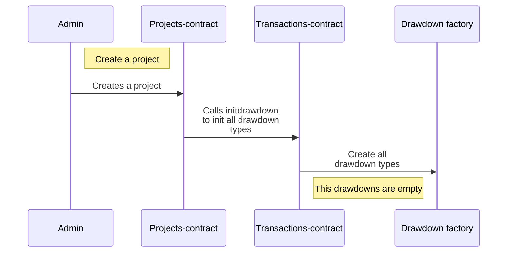
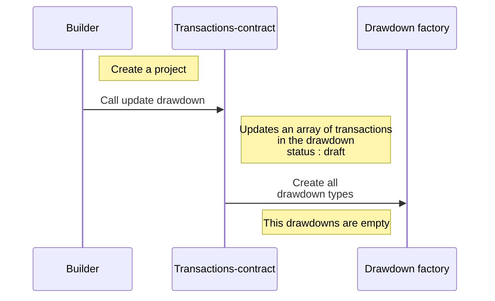

```mermaid
    sequenceDiagram
    Note right of Admin                 : Create a project 
    Admin->>Projects-contract                 : Creates a project
    Projects-contract->>Transactions-contract        : Calls initdrawdown<br>to init all drawdown<br>types
    Transactions-contract->>Drawdown factory  : Create all<br>drawdown types
    Note left of Drawdown factory     : This drawdowns are empty
```

# Drawdown flow

```mermaid
    sequenceDiagram
    Note right of Builder                 : Create a project 
    Builder->>Transactions-contract        : Call update drawdown
    Note right of Transactions-contract     : Updates an array of transactions<br>in the drawdown<br>status : draft
    Transactions-contract->>Drawdown factory  : Create all<br>drawdown types
    Note left of Drawdown factory     : This drawdowns are empty
```