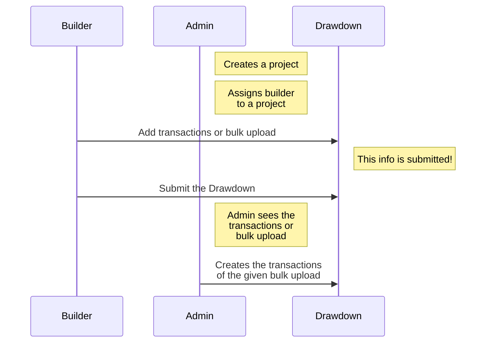

# Transactions structure

```mermaid
sequenceDiagram
    participant Builder
    participant Admin
    Note right of Admin: Creates a project
    Note right of Admin: Assigns builder<br>to a project
    Builder->>Drawdown: Add transactions or bulk upload
    Note right of Drawdown: This info is submitted!
    Builder->>Drawdown: Submit the Drawdown
    Note right of Admin: Admin sees the<br>transactions or<br>bulk upload
    Admin->>Drawdown : Creates the transactions<br>of the given bulk upload
```