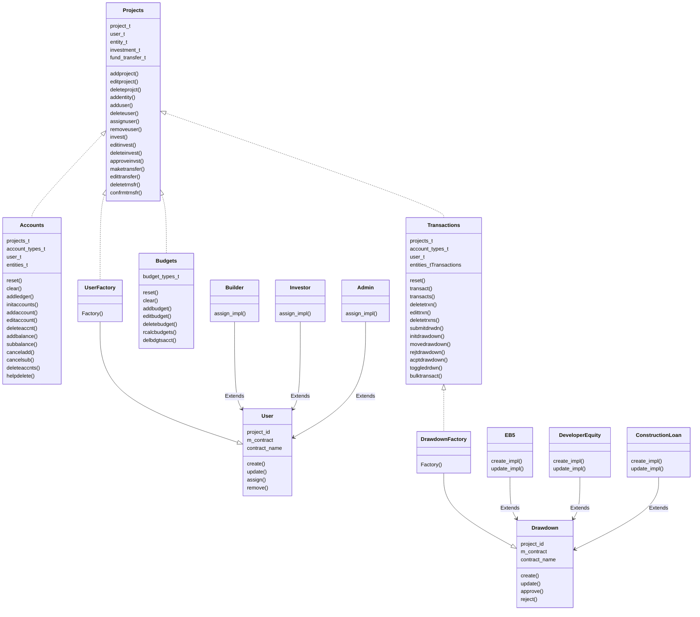

# Proxy class diagram

Explanation of the general flow of the classes / smart contracts.

```mermaid
  classDiagram
  Projects <|.. Accounts
  Projects <|.. Transactions
  Projects <|.. Budgets
  Projects : project_t
  Projects : user_t
  Projects : entity_t
  Projects : investment_t
  Projects : fund_transfer_t
  Projects : addproject()
  Projects : editproject()
  Projects : deleteprojct()
  Projects : addentity()
  Projects : adduser() 
  Projects : deleteuser()
  Projects : assignuser()
  Projects : removeuser()
  Projects : invest()
  Projects : editinvest()
  Projects : deleteinvest()
  Projects : approveinvst()
  Projects : maketransfer()
  Projects : edittransfer()
  Projects : deletetrnsfr()
  Projects : confrmtrnsfr()

  Projects <|.. UserFactory
  UserFactory --|> User
  UserFactory : Factory()
  User : project_id
  User : m_contract
  User : contract_name
  User : create()
  User : update()
  User : assign()
  User : remove()
  Builder--> User : Extends
  Builder : assign_impl()
  Investor --> User : Extends
  Investor : assign_impl()
  Admin --> User : Extends
  Admin : assign_impl()

  Accounts : projects_t
  Accounts : account_types_t
  Accounts : user_t
  Accounts : entities_t
  Accounts : reset()
  Accounts : clear()
  Accounts : addledger()
  Accounts : initaccounts()
  Accounts : addaccount()
  Accounts : editaccount()
  Accounts : deleteaccnt()
  Accounts : addbalance()
  Accounts : subbalance()
  Accounts : canceladd()
  Accounts : cancelsub()
  Accounts : deleteaccnts()
  Accounts : helpdelete()

  Transactions : projects_t
  Transactions : account_types_t
  Transactions : user_t
  Transactions : entities_tTransactions
  Transactions : reset()
  Transactions : transact()
  Transactions : transacts()
  Transactions : deletetrxn()
  Transactions : edittrxn()
  Transactions : deletetrxns()
  Transactions : submitdrwdn()
  Transactions : initdrawdown()
  Transactions : movedrawdown()
  Transactions : rejtdrawdown()
  Transactions : acptdrawdown()
  Transactions : toggledrdwn()
  Transactions : bulktransact()

  Transactions <|.. DrawdownFactory
  DrawdownFactory --|> Drawdown
  DrawdownFactory : Factory()
  Drawdown : project_id
  Drawdown : m_contract
  Drawdown : contract_name
  Drawdown : create()
  Drawdown : update()
  Drawdown : approve()
  Drawdown : reject()
  EB5--> Drawdown : Extends
  EB5 : create_impl()
  EB5 : update_impl()
  DeveloperEquity --> Drawdown : Extends
  DeveloperEquity : create_impl()
  DeveloperEquity : update_impl()
  ConstructionLoan --> Drawdown : Extends
  ConstructionLoan : create_impl()
  ConstructionLoan : update_impl()

  Budgets : budget_types_t
  Budgets : reset()
  Budgets : clear()
  Budgets : addbudget()
  Budgets : editbudget()
  Budgets : deletebudget()
  Budgets : rcalcbudgets()
  Budgets : delbdgtsacct()

```