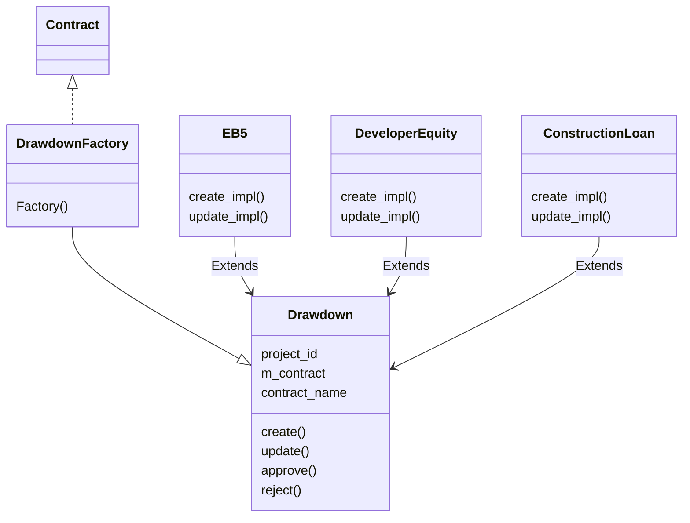

# Drawdown class diagram

This is how the generation of drawdown looks like

```mermaid
  classDiagram
  Contract <|.. DrawdownFactory
  DrawdownFactory --|> Drawdown
  DrawdownFactory : Factory()
  Drawdown : project_id
  Drawdown : m_contract
  Drawdown : contract_name
  Drawdown : create()
  Drawdown : update()
  Drawdown : approve()
  Drawdown : reject()
  EB5--> Drawdown : Extends
  EB5 : create_impl()
  EB5 : update_impl()
  DeveloperEquity --> Drawdown : Extends
  DeveloperEquity : create_impl()
  DeveloperEquity : update_impl()
  ConstructionLoan --> Drawdown : Extends
  ConstructionLoan : create_impl()
  ConstructionLoan : update_impl()
```