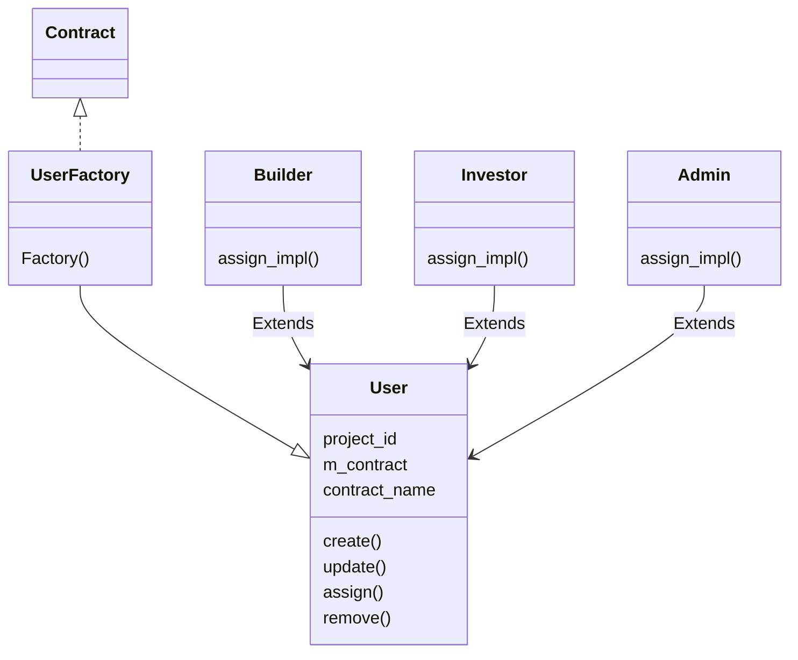

# User class diagram

This is how the generation of Users looks like

```mermaid
  classDiagram
  Contract <|.. UserFactory
  UserFactory --|> User
  UserFactory : Factory()
  User : project_id
  User : m_contract
  User : contract_name
  User : create()
  User : update()
  User : assign()
  User : remove()
  Builder--> User : Extends
  Builder : assign_impl()
  Investor --> User : Extends
  Investor : assign_impl()
  Admin --> User : Extends
  Admin : assign_impl()
```